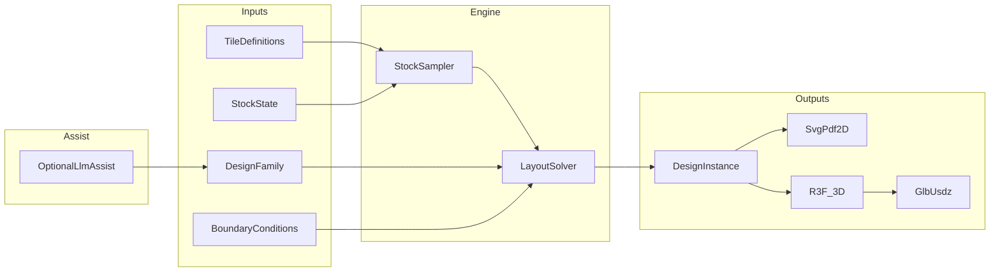
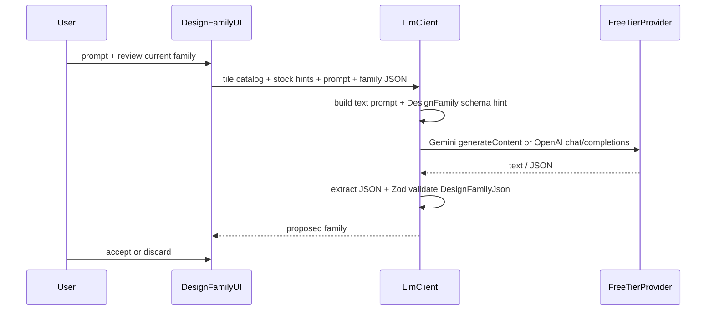

# Architecture — Vibed / Reused / Tiled

DMS 2026 hackathon POC: describe a **design family** (intent) under uncertain reused-tile stock, then produce a concrete **design instance** (placements) constrained by site boundaries. Repo: [repurposed-ch/vibed-reused-tiled](https://github.com/repurposed-ch/vibed-reused-tiled).

This document defines system layers, JSON schemas, app shell (Bun + Vite + HashRouter + GitHub Pages), design-family UI, optional LLM assist, render/export contracts, and a phased implementation plan.

---

## 1. Goals

Given:

1. **Tile definitions** — catalog of rectangular tile types
2. **Stock state** — how many of each type are available (exact or probabilistic)
3. **Design family** — how instances may combine (modules + soft constraints)
4. **Boundary conditions** — outer contours, holes, named guide geometries

Produce:

5. **Design instance** — a list of transformation matrices, each linked to a tile definition

Then visualize and export:

- 2D SVG (and PDF)
- 3D via React Three Fiber, with GLB / USDZ for AR

All project data round-trips through a single versioned JSON document (load / upload).

---

## 2. System layers



| Layer               | Responsibility                                                                   |
| ------------------- | -------------------------------------------------------------------------------- |
| **Domain**          | Schemas, Zod validation, project JSON IO                                         |
| **Workflow**        | Stock sampling, layout solver (modules first, then constraint fill)              |
| **LLM**             | Optional assist: NL → proposed `DesignFamily` (validated before apply)           |
| **Math**            | Existing `src/math` kernel (`Container2`, `Geometry2`, `Mat3`, grid/boolean ops) |
| **Render / export** | SVG/PDF, R3F, GLB/USDZ                                                           |
| **App**             | Hash-routed React UI for each workflow step                                      |

---

## 3. Package layout (target)

```
vibed-reused-tiled/
├── architecture.md
├── readme.md
├── package.json                 # Bun scripts
├── bun.lock
├── vite.config.ts               # base: '/vibed-reused-tiled/'
├── tsconfig.json
├── index.html
├── .github/workflows/deploy-pages.yml
├── assets/
└── src/
    ├── math/                    # existing geometric kernel
    ├── domain/                  # schemas, Zod, project serialize/deserialize
    ├── workflow/                # stock sampler, layout solver
    ├── llm/                     # prompt builders, client, response validate
    ├── render/
    │   ├── svg/                 # 2D SVG + PDF path
    │   └── r3f/                 # Three / R3F scene
    ├── export/                  # GLB, USDZ
    └── app/                     # routes, pages, design-family UI, settings
```

**Tooling defaults**

| Concern         | Choice                                                                           |
| --------------- | -------------------------------------------------------------------------------- |
| Package manager | Bun (`bun install`, `bun run dev`, `bun run build`, `bun test`)                  |
| App             | Vite + React + TypeScript                                                        |
| Validation      | Zod                                                                              |
| Router          | `HashRouter` (react-router)                                                      |
| Deploy          | GitHub Pages via Actions → `https://repurposed-ch.github.io/vibed-reused-tiled/` |

---

## 4. Domain schemas

All domain types are JSON-serializable. Math geometry reuses the existing `type`-tagged JSON from `src/math` (`Mat3Json`, `Container2` / region JSON via `Deserialise`, etc.). Domain objects sit beside that pattern and are validated with Zod before use.

### 4.0 Project document

```ts
/** Root document — load / upload this file. */
type TilingProjectJson = {
  type: 'TilingProject';
  schemaVersion: 3;
  meta?: { name?: string; updatedAt?: string };
  /** SDF-only material recipes (compiled to GLSL and baked at runtime). */
  materials: MaterialDefinitionJson[];
  tileDefinitions: TileDefinitionJson[];
  stock: StockStateJson;
  designFamily: DesignFamilyJson;
  boundaries: BoundaryConditionsJson;
  /** Optional cached solver output */
  instance?: DesignInstanceJson;
};
```

### 4.1 Materials and tile definition

**Materials** are SDF graphs only (`id`, `name`, `seed`, `sdf`). Appearance (color mode, edge UV) lives on tiles. At runtime the SDF compiles to GLSL and bakes to a 1024×1024 albedo (WebGL2 `OffscreenCanvas`).

```ts
type MaterialDefinitionJson = {
  type: 'MaterialDefinition';
  id: string;
  name: string;
  seed: number;
  sdf: SdfNodeJson; // tagged union: noise, cells, voronoi, brick, truchet, stripe, checker,
                    // scratches, halftone, warp, curve/posterize/threshold/remap/invert,
                    // circle/box/ring/line, CSG, transforms, mix/mul/add/overlay/screen
};
```

**Tile color:** brightness (one hex → SDF as brightness) or Quilez palette (three hex → `a,b,d`, plus float triple `c` editable with sliders, default `(1,1,1)`). Hex in JSON; shader uses 0–1 RGB for `a,b,d`.

**Seamlessness:** `uPeriod` is per-axis (`= uTileSize`), so non-square tiles close on both axes. Lattice primitives snap their own cell counts to integers via `cellCount` / `latticeP`, so they always tile — but three things snapping cannot fix, because correcting them would change the design:

| op | seamless when |
|---|---|
| `rotate` | 0° or 180°. 90°/270° only on a **square** tile — they swap the axes, and per-axis periods differ on a rectangle. |
| `scale` | `factor = 1/m` for a positive integer `m`, per axis |
| `repeat` | `period` divides the tile size on both axes |

Everything else is unconditionally safe: `warp` preserves whatever periodicity its child had (the displacement is additive and periodic, so it commutes with lattice translation), and the pointwise ops (`curve`, `posterize`, `threshold`, `remap`, `invert`, `overlay`, `screen`, `band`, `fill`, `mix`, `mul`, `add`, CSG) inherit their children's.

`mirror` is a **no-op at the root** — `p` is non-negative there, so `abs(p) == p`. It only does anything beneath a `translate` or `repeat`.

Shade nodes must return 0..1; a value outside that range is reinterpreted as a signed distance and hard-thresholded (`toShade`).

`seamlessnessReport()` audits a graph statically and is surfaced on the Materials page alongside a `seamError` readout of the baked texture. `maxSeamDelta` / `maxPeriodDelta` (CPU reference in `sdf-cpu.ts`) cover it in tests, since the node test environment has no WebGL.

**Rhythm / edges:** omit rhythm → continuous UV; all four sides required for edged UV (SDF mirrored/merged per edge so matching labels stay continuous). Partial rhythm is invalid.

**Local frame:** corner at origin; **+X = length**, **+Y = width**; thickness along **+Z** in 3D.

```ts
type FacadeSide = 'south' | 'east' | 'north' | 'west';

type RhythmSideJson = {
  name: string;
  mirrored: boolean;
};

type TileColorJson =
  | { mode: 'brightness'; color: string }
  | { mode: 'palette'; colors: [string, string, string]; c: [number, number, number] };

type TileDefinitionJson = {
  type: 'TileDefinition';
  id: string;
  name: string;
  length: number;
  width: number;
  thickness: number;
  materialId: string;
  color: TileColorJson;
  texture?: string; // optional cached bake data URL
  rhythm?: Record<FacadeSide, RhythmSideJson>; // all four or omit
};
```

### 4.2 Stock state

Per tile type: either an exact count or a distribution used by the stock sampler before solving.

```ts
type StockEntryExactJson = {
  tileDefinitionId: string;
  kind: 'exact';
  count: number;
};

type StockEntryDistributionJson = {
  tileDefinitionId: string;
  kind: 'distribution';
  distribution: 'poisson' | 'normal' | 'uniform';
  /** poisson: { lambda }; normal: { mean, stdDev }; uniform: { min, max } */
  params: Record<string, number>;
};

type StockStateJson = {
  type: 'StockState';
  entries: Array<StockEntryExactJson | StockEntryDistributionJson>;
};
```

**Sampler output** (runtime, not necessarily persisted): `{ tileDefinitionId: string; count: number }[]` plus the RNG `seed` used.

### 4.3 Design family (modules + soft constraints)

Primary authorable unit: **modules** — named groups of relative placements. Secondary: **soft constraints** with weights for leftover fill after modules are placed.

```ts
type Mat3Json = {
  type: 'Mat3';
  /** column-major 3×3 homogeneous, as in src/math/core/mat3.ts */
  elements: [number, number, number, number, number, number, number, number, number];
};

type ModulePlacementJson = {
  /** Local id within the module */
  id: string;
  tileDefinitionId: string;
  /** Pose relative to module origin */
  localMat3: Mat3Json;
  role?: string;
};

type ModuleRepeatJson = {
  count: number;
  /** Offset applied between repeats in module-local space */
  offsetMat3: Mat3Json;
};

type DesignModuleJson = {
  type: 'DesignModule';
  id: string;
  name: string;
  placements: ModulePlacementJson[];
  /** Optional nested modules (instanced by id + local transform) */
  children?: Array<{ moduleId: string; localMat3: Mat3Json }>;
  repeat?: ModuleRepeatJson;
  /** How the module anchors when dropped into a boundary / guide */
  anchor?: 'origin' | 'centroid' | 'bboxMin';
};

type ConstraintKind =
  | 'rhythmMatch' // adjacent sides share name (respecting mirrored)
  | 'adjacencyPrefer' // prefer certain tileDefinitionId pairs
  | 'materialAlternate'
  | 'gapTolerance'; // max gap between edges

type SoftConstraintJson = {
  id: string;
  kind: ConstraintKind;
  weight: number; // higher = stronger preference
  params: Record<string, unknown>;
};

type DesignFamilyJson = {
  type: 'DesignFamily';
  id: string;
  name: string;
  modules: DesignModuleJson[];
  /** Module ids preferred for primary fill order */
  primaryModuleIds: string[];
  constraints: SoftConstraintJson[];
};
```

**Solver strategy (high level):** place / repeat primary modules inside free region → score remaining candidates with soft constraints → greedy pack leftover stock until stock or space is exhausted.

### 4.4 Boundary conditions

Outer contours and holes are `Container2` JSON (regions / AABB / half-planes from `src/math/geometry/kinds.ts`). Named guides are `Geometry2` JSON (points, line-likes, polylines, polygons, etc.).

```ts
/** Discriminated math JSON already produced by *.toJson() in src/math */
type Container2Json = /* Circle2 | Polygon2 | TriMesh2 | Aabb2 | InfiniteLine2 JSON */;
type Geometry2Json = /* Vec2 | LineLike2 | Polyline2 | Polygon2 | Circle2 | TriMesh2 | Aabb2 JSON */;

type NamedGuideJson = {
  id: string;
  name: string;
  geometry: Geometry2Json;
};

type BoundaryConditionsJson = {
  type: 'BoundaryConditions';
  outers: Container2Json[];
  holes: Container2Json[];
  guides: NamedGuideJson[];
};
```

Free region conceptually: union of `outers` minus `holes`. Guides do not clip; they bias alignment / rhythm axes in the solver and UI.

### 4.5 Design instance (output)

```ts
type PlacementJson = {
  id: string;
  tileDefinitionId: string;
  /** World transform of the tile local frame */
  mat3: Mat3Json;
  /** If this placement came from a module instance */
  moduleId?: string;
};

type DesignInstanceJson = {
  type: 'DesignInstance';
  placements: PlacementJson[];
  meta?: {
    seed?: number;
    sampledStock?: Array<{ tileDefinitionId: string; count: number }>;
    unmetConstraintIds?: string[];
    solverStats?: Record<string, number>;
  };
};
```

---

## 5. Serialization contract

- Math types keep existing `toJson()` / `Deserialise.fromJson`.
- Domain types use the same `type` discriminator field.
- `src/domain` owns Zod schemas for all `*Json` above and `parseTilingProject(unknown): TilingProjectJson`.
- UI supports **download** and **upload** of the full `TilingProjectJson`.
- Design-family page also supports import/export of a `DesignFamilyJson` fragment.

---

## 6. App shell — routes and deploy

### 6.1 Hash routes

`HashRouter` so deep links work on GitHub Pages without server rewrites. Vite `base: '/vibed-reused-tiled/'`.

| Hash path         | Page                                                              |
| ----------------- | ----------------------------------------------------------------- |
| `#/`              | Overview — project name, load / save JSON                         |
| `#/tiles`         | Tile definition editor + rhythm visualization                     |
| `#/stock`         | Exact counts and distributions                                    |
| `#/design-family` | Design-family builder (modules, constraints, preview, LLM assist) |
| `#/boundaries`    | Outers, holes, named guides                                       |
| `#/solve`         | Sample stock, run solver, inspect instance                        |
| `#/view/2d`       | SVG view + PDF export                                             |
| `#/view/3d`       | R3F view + GLB / USDZ export                                      |
| `#/settings`      | LLM provider / model / API key (local only)                       |

### 6.2 GitHub Pages

- Workflow: `.github/workflows/deploy-pages.yml`
  - `bun install` → `bun run build` → upload `dist/` → deploy to Pages
- Target: `https://repurposed-ch.github.io/vibed-reused-tiled/`
- Repo Pages source: GitHub Actions

### 6.3 Local scripts (Bun)

```bash
bun install
bun run dev      # Vite dev server
bun run build    # production build into dist/
bun test
```

---

## 7. Design-family UI

`#/design-family` is a first-class authoring surface:

1. **Module list** — create / rename / delete; select active module
2. **Module canvas** — place tiles from the catalog; drag / rotate / snap; edits write `localMat3`
3. **Nesting / repeat / anchor** — controls for children, `ModuleRepeatJson`, anchor mode
4. **Constraint panel** — add weighted soft rules (`rhythmMatch`, `adjacencyPrefer`, `materialAlternate`, `gapTolerance`)
5. **Live SVG preview** of the active module (and optional expanded repeat)
6. **Import / export** family JSON fragment
7. **Assist with LLM** — natural-language propose/edit of `DesignFamily` (see §8)

Primary module order (`primaryModuleIds`) is editable for solver priority.

---

## 8. Optional LLM assist

GitHub Pages is static: no secret backend in this repo. The client calls free-tier providers from the browser (Gemini native API, or OpenAI-compatible `chat/completions`). Catalog curated from [awesome-free-llm-apis](https://github.com/mnfst/awesome-free-llm-apis). Cloudflare Workers AI and Cohere are skipped (account id / non-OpenAI shape).



**Rules**

- Provider + model from `#/settings` (defaults: OVHcloud anonymous, first model); optional `VITE_LLM_PROVIDER` / `VITE_LLM_MODEL`
- API key in **localStorage only** when the provider requires one; keyless providers (OVHcloud, LLM7, Kilo) enable Assist without a key
- Response must parse as `DesignFamilyJson` via Zod; invalid responses are rejected with an error
- CORS or key restrictions may block some browser calls — switch provider or use a proxy for production

**Request shape (conceptual)**

```ts
type LlmAssistRequest = {
  prompt: string;
  tileDefinitions: TileDefinitionJson[];
  stock?: StockStateJson;
  currentFamily?: DesignFamilyJson;
};
```

The client wraps this into a text prompt and asks for DesignFamily JSON only.
---

## 9. Rendering and export

### 9.1 2D (SVG → PDF)

- For each `PlacementJson`, apply `mat3` to the tile rectangle `(0,0)–(length,width)`.
- Emit SVG `<g transform="matrix(a,b,c,d,e,f)">` (map from column-major `Mat3`).
- Draw fill from display color only (`brightness.color` or palette middle swatch); no textures in layout 2D.
- Boundaries / guides as underlay.
- PDF: print stylesheet or SVG→PDF helper from the 2D view.
- Tile definitions authoring preview uses the baked texture with rhythm labels overlaid.

### 9.2 3D (R3F) and AR export

- Extrude each tile by `thickness` along local +Z; apply world transform from `mat3` (planar XY).
- Albedo from GLSL bake: SDF + tile color mode (brightness or Quilez palette) + continuous or edged UV (rhythm).
- Export in-browser from the R3F tile export group:
  - **GLB** via Three.js `GLTFExporter` (embedded baked images)
  - **USDZ** via Three.js `USDZExporter` (`quickLookCompatible`, horizontal plane anchoring)
- Floor / helpers use `userData.export === false`.
- Project JSON download embeds optional `tile.texture` data URLs.

---

## 10. Math kernel reuse

Existing building blocks under `src/math` the workflow should prefer:

| Need                      | Module                                                             |
| ------------------------- | ------------------------------------------------------------------ |
| World poses               | `Mat3`, `Frame2` (`src/math/core/`)                                |
| Containment / free region | `Contains2`, `Boolean2`                                            |
| Footprint → grid          | `detectRectilinearGridFromPolygons`, `buildGrid2FromWorldPolygons` |
| Rectangle cover           | `decomposeOccupancyIntoRectangles`                                 |
| Persist geometry          | `toJson` + `Deserialise` (`src/math/io/deserialise.ts`)            |
| Type unions               | `Container2`, `Geometry2` (`src/math/geometry/kinds.ts`)           |

---

## 11. Implementation plan

| Phase                          | Focus                                                                                                                                  | Exit criteria                                                                |
| ------------------------------ | -------------------------------------------------------------------------------------------------------------------------------------- | ---------------------------------------------------------------------------- |
| **0 — Scaffold & Pages**       | Bun + Vite + React + TS; `base: '/vibed-reused-tiled/'`; HashRouter shell with empty route pages; `.github/workflows/deploy-pages.yml` | `bun run build` succeeds; Pages deploys; all hash routes render placeholders |
| **1 — Domain + tile/stock UI** | Zod schemas for all §4 types; project load/save; `#/tiles` (incl. rhythm viz) and `#/stock`                                            | Round-trip `TilingProjectJson`; edit tiles and stock in UI                   |
| **2 — Boundaries**             | `#/boundaries` editor for outers / holes / named guides using math JSON                                                                | Visualize and persist `BoundaryConditionsJson`                               |
| **3 — Design-family UI + LLM** | Module canvas, constraints, preview; `#/settings` + `src/llm` assist client                                                            | Author a family by hand; optional LLM propose → Zod → review → apply         |
| **4 — Solver v1**              | Sample stock → place primary modules → greedy constraint fill using contains/boolean/grid helpers                                      | `DesignInstanceJson` written into project; visible on `#/solve`              |
| **5 — SVG / PDF**              | `#/view/2d` from instance + tile defs                                                                                                  | Screen SVG + PDF export                                                      |
| **6 — R3F / GLB / USDZ**       | `#/view/3d` + export pipeline                                                                                                          | Interactive 3D; download GLB and USDZ                                        |
| **7 — Polish**                 | Load/save UX, multi-sample variants, seed control                                                                                      | Multiple instances from one family + stock distributions                     |
| **8 — Docs**                   | Pages URL, Bun scripts, Gemini LLM notes in `readme.md` / this file                                                                    | Contributor can run locally and deploy without guessing                      |

Phases 0–3 unlock authoring and deploy; 4–6 close the generate → visualize → export loop; 7–8 harden the hackathon demo.

---

## 12. Locked decisions

| Topic            | Decision                                                     |
| ---------------- | ------------------------------------------------------------ |
| Design family    | Modules (primary) + soft constraints (leftover fill)         |
| Tile local frame | Origin at corner; +X length; +Y width; +Z thickness          |
| Router           | HashRouter                                                   |
| Vite base        | `/vibed-reused-tiled/`                                       |
| Tooling          | Bun                                                          |
| Validation       | Zod                                                          |
| LLM              | Optional; browser → free-tier providers (Gemini or OpenAI-compat); validate before apply |
| Persistence      | Single `TilingProjectJson` file                              |

---

## 13. Out of scope for v1 architecture

- Full CAD interoperability
- Exact global-optimum packing
- Hosted LLM backend in this repository
- Offline-first sync / multi-user editing
