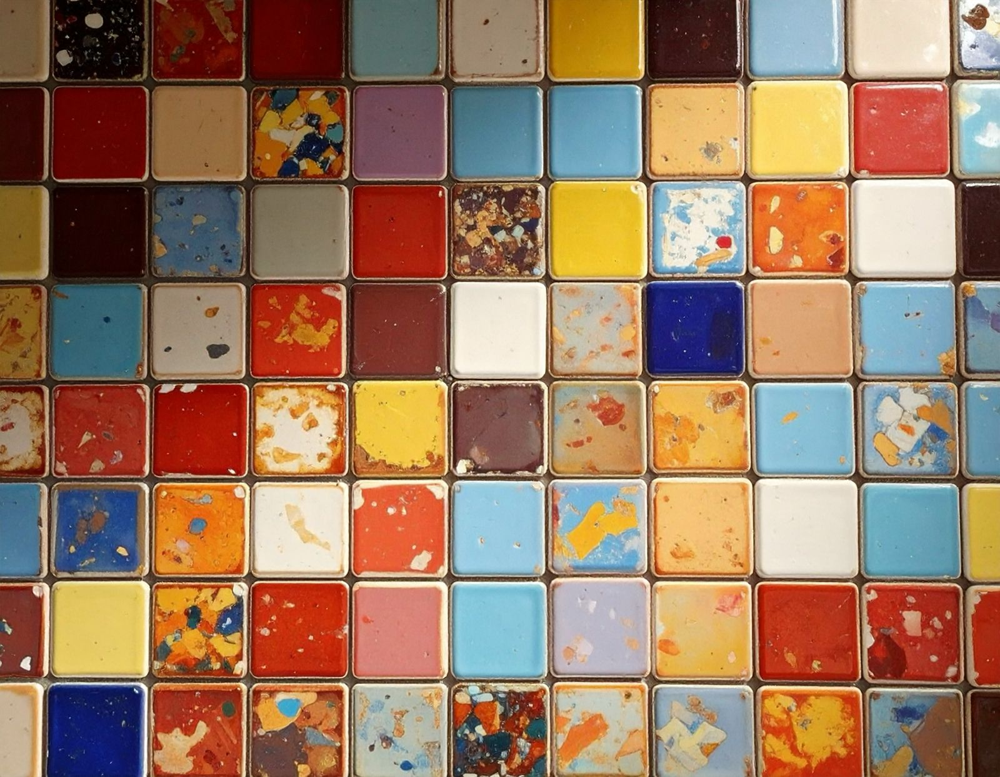

### DMS 2026 - hackathon

# Vibed - Reused - Tiled

Industrial materials are calibrated to demand, reused ones are not. In reuse we start with a limited stock of tiles with rough dimensions and properties. We can have a rough idea of how many tiles of each type to expect, but no exact numbers. How do we as designers describe tiling patterns without precisely knowing what we will be able to build with? How do we keep our creative control?

Instead of creating one fixed solution, we as designers need to describes an intention, a “vibe” – an aesthetic, geometric pattern, texture, material quality, or cultural reference. But how do we describe this “vibe” in a way that we can still control both the design and construction phase? Should we have to think rather in Design Families? And how should this be visualized? CAD may work for the designer, but not necessarily for a client or a contractor on site. What medium would best be suited to connect the different perspectives?

